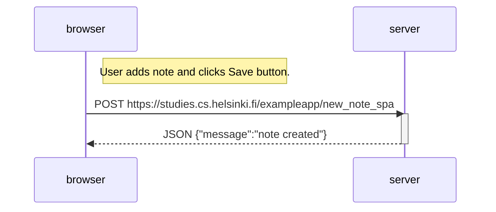

```mermaid
sequenceDiagram
    participant browser
    participant server

    Note right of browser: User adds note and clicks Save button.

    browser->>server: POST https://studies.cs.helsinki.fi/exampleapp/new_note_spa
    activate server
    server-->>browser: JSON {"message":"note created"}
    deactivate server
```